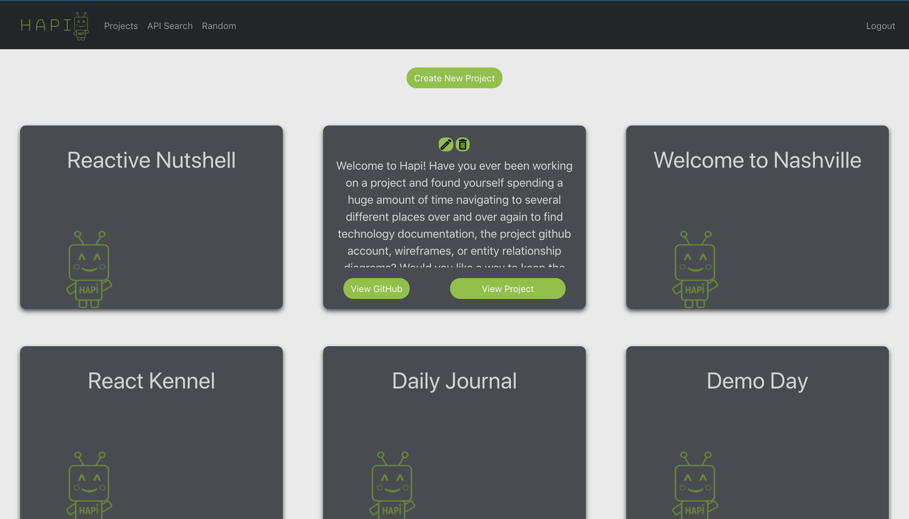
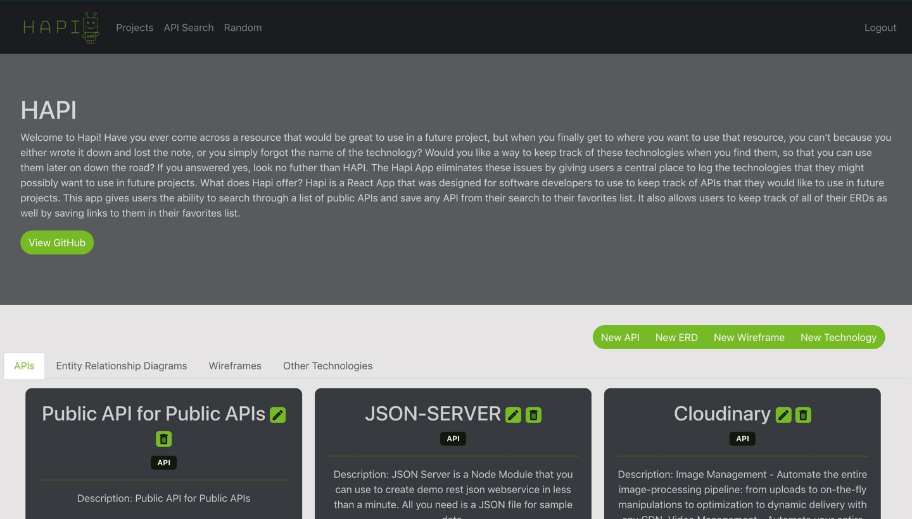
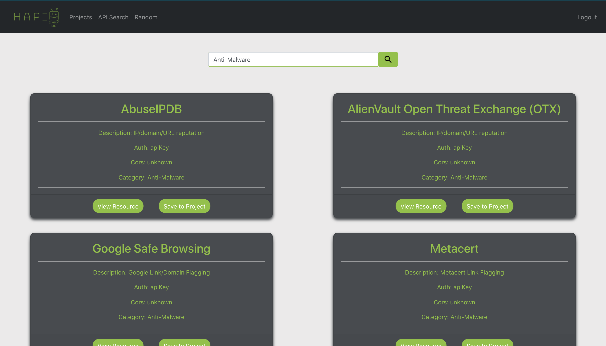
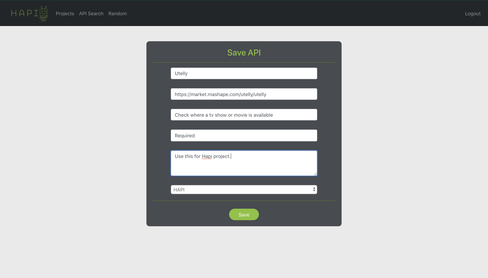
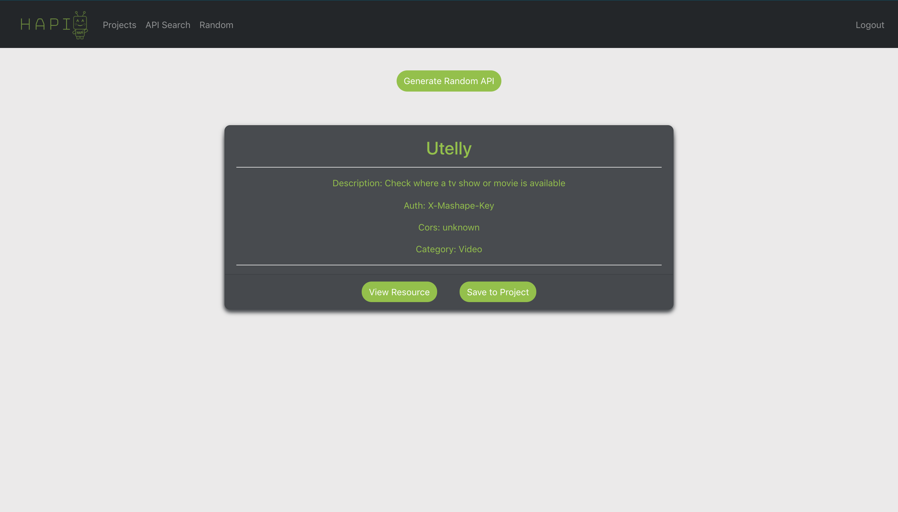
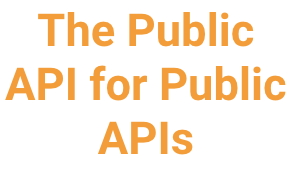

# Welcome to Hapi! 
Have you ever been developing an app and found yourself spending a huge amount of time navigating to several different places over and over again to find technology documentation, the project github account, wireframes, or entity relationship diagrams? Would you like a way to keep the resources and documentation for your project in one place so that they are quickly accessible? If you answered yes, look no futher than HAPI.

## Why was Hapi created?
As a software developer, I spend a large amount of time navigating to the same URLs over and over again to find API and technology documentation, project GitHub accounts, wireframes, and entity relationship diagrams. Remembering exactly where the documentation was found or trying to go back and find the URL to a specific resource can become a time consuming process when working on a project. 

## What is Hapi?
Hapi is a single page, React application that was designed to save software developers time by giving them a means to create project boards where they can keep track of the APIs, ERDs, Wireframes, Technologies, documentation, and notes that they are using in specific projects so that these resources are easily accessible in one central place. With Hapi, users have the ability to create project boards and log APIs, ERDs, Wireframes, and Technologies under the different projects that they are working on through full CRUD functionality. This app also gives users the ability to search through a list of public APIs and save any API from their search to one of their project boards.

## Want to use Hapi? Follow the instructions bellow to run the application.

1. Clone down this repository by clicking the "Clone or Download" button above, copying the SSH key, and running the following command in your terminal `git clone SSH KEY GOES HERE`.
1. `cd` into the root directory of the app.
1. Run `npm install` and wait for all dependencies to be installed.
1. `cd` into /src/modules and open Credentials.js.example.
1. You must sign up for a Cloudinary account and get your own Cloudname and Upload preset to use the image upload functionality in the Hapi app. Once you have these, put them into the appropriate spot in the Credentials.js.example file.
1. Remove the .example from the Credentials.js.example file.
1. Run `npm start` to verify that installation was successful and start the application.
1. `cd` into the /api directory, and remove the .example extention from the database.json.example file. 
1. In the api folder, run `json-server -p 5002 -w database.json`.
1. Go to http://localhost:3000/ to view the app. 

## What can you do with Hapi?
1. After completing the setup above, in the browser, navigate to http://localhost:3000.
2. If you are a returning user, login to Hapi with your account information.
3. Never signed up for Hapi before? No problem! Click the register a new account link and complete your registration.

4. Once you have logged into the app, you will be taken to your personal projects page where you can see all of the projects that you have created so far. To add another project, click the "Create Project" button. To edit or delete a project, hover over the project card and click the appropriate icon. If you wish to view the project's GitHub account, click "View Resource" and if you wish to view the technologies being used on a project, click "View Project". 

5. If you choose to view a project, you will be taken to the project details page. From here you can see the project name, description, and a button that will take you to the project's GitHub account. You also have the ability to view the technologies for the project by clicking the different APIs, Wireframes, ERDs, and technologies tabs. If you want to add a new resource, click the appropriate button to add a new technology to your list. 

6. If you choose the "API Search" option from the navigation bar, you will be taken to a page where you can type search terms into an input box, and select a category from the dropdown that populates as you type. Once you have selected a category, press the search button and your search results will populate below. 

7. Once the search results populate, if you wish view the website for a certain API, select the "View Resource" button. If you wish to save any of the search results to one of your project boards, click the "Save to Project" button. 

8. If you click the "Save to Project" button, you will be taken to another page with a form where you can select the project to which you want to save the API from a dropdown. Once you have selected a project, click "Save" and then you will be redirected to the project board where you will see your new API. 

9. If you choose the "Random" option from the navigation bar, you will be taken to a page where a random API is generated for you. You can click the "Generate Random API" button to generate a new API. If you wish view the website for the API, select the "View Resource" button. If you wish to save the API to one of your project boards, click the "Save to Project" button. 

## Hapi Tech Stack

&nbsp&nbsp&nbsp&nbsp&nbsp&nbsp&nbsp&nbsp&nbsp&nbsp&nbsp&nbsp&nbsp&nbsp&nbsp&nbsp&nbsp&nbsp&nbsp&nbsp&nbsp&nbsp&nbsp&nbsp

&nbsp&nbsp&nbsp&nbsp&nbsp&nbsp&nbsp&nbsp&nbsp&nbsp&nbsp&nbsp&nbsp&nbsp&nbsp&nbsp&nbsp&nbsp&nbsp&nbsp&nbsp&nbsp&nbsp&nbsp

